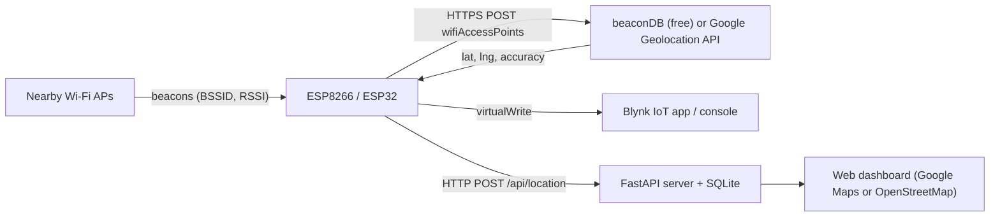

# Wi-Fi Triangulation Geolocation Tracker

Locate an ESP8266 / ESP32 board **without a GPS module**. The board scans nearby Wi-Fi
access points (BSSID + signal strength + channel), sends them to a Wi-Fi geolocation
service, and gets back latitude, longitude and an accuracy radius. It supports the free,
keyless **beaconDB** and the **Google Maps Geolocation API**. Fixes are shown on a
**Blynk IoT** dashboard and/or the bundled **web dashboard**.

**Hardware:** one ESP8266 (NodeMCU, Wemos D1 mini, ...) or ESP32 dev board. No wiring.



## Project layout

```
wifi-geolocation-tracker/
├── firmware/WiFiGeoTracker/
│   ├── WiFiGeoTracker.ino     # sketch for ESP32 and ESP8266
│   └── config.example.h       # copy to config.h and add your keys
├── server/
│   ├── main.py                # FastAPI backend (REST API + static dashboard)
│   ├── static/                # dashboard UI; maps.js holds the Google Maps and Leaflet backends
│   └── .env.example           # copy to .env
├── tools/
│   ├── pc_geolocate.py        # locate your PC (Windows location, beaconDB or Google)
│   └── simulate_device.py     # push a fake moving track to the dashboard
└── requirements.txt
```

## How the firmware works

Every `SCAN_INTERVAL_MS` (30 s by default) the board:

1. **Scans** all visible networks, including hidden ones, and sorts them by RSSI.
2. **Filters** them:
   - drops SSIDs ending in `_nomap`, because their owners have opted out of location services;
   - drops APs weaker than `MIN_RSSI_DBM`;
   - drops *locally administered* (randomised) MACs such as phone hotspots, because they
     move around and corrupt the fix. They are only kept if there would otherwise be too few APs.
   - keeps the strongest `MAX_APS` (15).
3. **Checks for movement.** It compares the visible BSSID set with the set used for the last
   query (Jaccard similarity). If the device looks stationary and the last fix is less than
   `FORCE_REFRESH_MS` old, it **skips the geolocation call** and reuses the previous fix.
4. **Queries the geolocation service** (`GEO_PROVIDER`: beaconDB or Google; both use the same
   format) with `considerIp: false`, so the result comes from Wi-Fi only. Coarse IP-based or
   cell-tower fallback answers are rejected:
   ```json
   { "considerIp": false,
     "wifiAccessPoints": [ { "macAddress": "60:A4:B7:B2:3A:98", "signalStrength": -61, "channel": 1 }, ... ] }
   ```
5. **Publishes** the fix to Blynk and/or the web dashboard. While stationary, it republishes
   the last fix every `HEARTBEAT_MS` so the dashboard still shows the device as "Live".

## 1. Choose a location provider

| Provider | Cost | Coverage | Used by |
| --- | --- | --- | --- |
| **beaconDB** | Free, no key, no account | Community-built and growing. Many areas, including much of India, aren't covered yet | Board and PC tool |
| **Google Geolocation API** | 10,000 free requests a month, but needs a billing account with a card | Worldwide, accurate | Board and PC tool |
| **Windows Location Service** | Free, built into Windows | Good. Uses Microsoft's Wi-Fi database | PC tool only (the board can't use it) |

### Free option: beaconDB

The board uses beaconDB by default (`#define GEO_PROVIDER GEO_PROVIDER_BEACONDB` in `config.h`),
so no key is needed. beaconDB only knows networks that someone has reported. If it returns
`404 notFound` in your area, add your neighbourhood yourself:

1. Install **NeoStumbler** on an Android phone (free, from F-Droid or Google Play).
2. In its settings, make sure the upload endpoint is beaconDB (`https://api.beacondb.net`).
3. Turn on GPS and walk or drive around the places where the tracker will be used. The app
   uploads the Wi-Fi networks it sees along with your GPS position.
4. New networks are usable about 5 minutes after upload.

Check coverage from your PC (no key needed):

```powershell
python tools\pc_geolocate.py --provider beacondb
```

### Free option on a PC: Windows Location Service

To see your real location on the dashboard without any key or hardware:

```powershell
python tools\pc_geolocate.py --provider windows --post
```

This needs *Settings → Privacy & security → Location → Location services* and
*Let desktop apps access your location* turned on.

### Paid option with a free allowance: Google Geolocation API

To use Google on the board, set `#define GEO_PROVIDER GEO_PROVIDER_GOOGLE` and `GOOGLE_API_KEY`
in `config.h`.

1. Open the [Google Cloud Console](https://console.cloud.google.com/), create a project and
   **enable billing**. The Geolocation API needs a billing account, even inside the free monthly quota.
2. Go to **APIs & Services → Library**, find **Geolocation API** and click **Enable**.
3. Go to **APIs & Services → Credentials → Create credentials → API key**.
4. Click the new key, then under **API restrictions** choose **Restrict key → Geolocation API**.
   The key is stored on the board, so limit what it can do.
5. Check the current [pricing](https://developers.google.com/maps/billing-and-pricing/pricing)
   and set a **quota cap** under *Geolocation API → Quotas*. With the default settings, a
   stationary device makes about 4 calls per hour (`FORCE_REFRESH_MS` = 15 min). A moving
   device can make up to 120 calls per hour (one per 30 s scan).

Test the key from your PC before touching hardware:

```powershell
cd wifi-geolocation-tracker
copy server\.env.example server\.env     # then set GOOGLE_API_KEY=... in server\.env
python tools\pc_geolocate.py --provider google
```

## 2. Run the web dashboard

```powershell
cd wifi-geolocation-tracker
python -m venv .venv; .\.venv\Scripts\Activate.ps1   # or reuse an existing venv
pip install -r requirements.txt
copy server\.env.example server\.env                 # set DEVICE_API_KEY to a random secret
uvicorn server.main:app --host 0.0.0.0 --port 8000
```

Open <http://127.0.0.1:8000>. To see it working without hardware, run:

```powershell
python tools\simulate_device.py                       # demo track around New Delhi
python tools\simulate_device.py --lat 51.5074 --lng -0.1278 --count 60 --interval 1
python tools\pc_geolocate.py --post                   # your real PC location
```

The board must be able to reach the server, so:

- find your PC's LAN IP with `ipconfig` (for example `192.168.1.50`) and use it in `DASHBOARD_URL`;
- allow inbound TCP 8000 through Windows Firewall (as Administrator):
  `New-NetFirewallRule -DisplayName "GeoTracker 8000" -Direction Inbound -Protocol TCP -LocalPort 8000 -Action Allow`

The dashboard shows the live position with its accuracy circle, the track colour-coded by
accuracy (green ≤ 30 m, amber ≤ 100 m, red > 100 m), distance travelled, the APs used for the
last fix with signal bars, a recent-fixes table, and a one-click "Open in Google Maps" link.
It uses OpenStreetMap (street, dark and satellite layers) by default, or Google Maps if you
add a key as described below.

### Google Maps on the dashboard (optional)

With a Maps JavaScript API key, the dashboard map becomes a real Google Map with Roadmap,
Satellite, Hybrid and Terrain views, Street View (drag the yellow figure onto the map),
fullscreen and a dark theme. A **Map** selector appears in the header so you can switch back
to OpenStreetMap at any time. If Google rejects the key, the dashboard switches to
OpenStreetMap automatically and shows a warning explaining what to check.

1. In the same Google Cloud project, go to **APIs & Services → Library** and enable
   **Maps JavaScript API**.
2. Create a **separate** API key (**Credentials → Create credentials → API key**). Do not reuse
   the Geolocation key, because this key is sent to every browser that opens the dashboard.
3. Restrict the new key:
   - **Application restrictions → Websites**, and add the addresses you open the dashboard from,
     for example `http://127.0.0.1:8000/*`, `http://localhost:8000/*` and `http://192.168.0.103:8000/*`;
   - **API restrictions → Maps JavaScript API**.
4. Put it in `server/.env` and restart the server:
   ```
   GOOGLE_MAPS_JS_KEY=AIza...
   ```
5. Optional: create a map ID under **Google Maps Platform → Map management** and set
   `GOOGLE_MAPS_MAP_ID`. Without one, the dashboard uses Google's `DEMO_MAP_ID`, which is
   fine for personal use.

Each dashboard page load counts as one Dynamic Maps load. The polling that follows doesn't
reload the map, so normal use stays well inside the free monthly allowance; check current
[pricing](https://developers.google.com/maps/billing-and-pricing/pricing).

### REST API

| Method | Path | Description |
| --- | --- | --- |
| `POST` | `/api/location` | Ingest a fix. Requires header `X-Device-Key: <DEVICE_API_KEY>` |
| `GET` | `/api/devices` | Devices with their latest fix and fix count |
| `GET` | `/api/locations?device_id=..&since=<unix>&limit=..` | Track history (oldest first) |
| `GET` | `/api/latest?device_id=..` | Latest fix including the AP list |
| `GET` | `/api/config` | Browser map settings (Maps JavaScript key and map ID) |

Interactive docs: <http://127.0.0.1:8000/docs>.

## 3. Flash the firmware

**Arduino IDE 2.x**

1. *File → Preferences → Additional boards manager URLs*, add:
   - ESP32: `https://espressif.github.io/arduino-esp32/package_esp32_index.json`
   - ESP8266: `https://arduino.esp8266.com/stable/package_esp8266com_index.json`
2. *Boards Manager*: install **esp32** by Espressif and/or **esp8266** by ESP8266 Community.
3. *Library Manager*: install **ArduinoJson** (v7) and, if you use Blynk, **Blynk**.
4. Copy `firmware/WiFiGeoTracker/config.example.h` to `config.h` in the same folder and fill in
   your Wi-Fi credentials, `GEO_PROVIDER` (and `GOOGLE_API_KEY` if you use Google),
   `DASHBOARD_URL`, `DASHBOARD_KEY` (same value as `DEVICE_API_KEY`) and the optional Blynk values.
5. Open `WiFiGeoTracker.ino`, select your board (for example *NodeMCU 1.0 (ESP-12E Module)* or
   *ESP32 Dev Module*) and the COM port, then click **Upload**.
6. Open the Serial Monitor at **115200 baud**:

```
=== Wi-Fi Triangulation Geolocation Tracker ===
[wifi] connected, IP 192.168.1.73, RSSI -52 dBm
[scan] 9 networks visible, 7 usable
    1  60:A4:B7:B2:3A:98  ch1    -48 dBm  TP-Link_3A98
    2  ...
[geo] querying beaconDB with 7 APs
[geo] FIX  lat 28.613912  lng 77.209021  +/- 24 m  (7 APs, similarity 0.00)
[geo] https://maps.google.com/?q=28.613912,77.209021
[dash] published
```

**arduino-cli**

```powershell
arduino-cli lib install ArduinoJson Blynk
arduino-cli compile --fqbn esp32:esp32:esp32 firmware/WiFiGeoTracker
arduino-cli upload  --fqbn esp32:esp32:esp32 -p COM5 firmware/WiFiGeoTracker
# ESP8266: --fqbn esp8266:esp8266:nodemcuv2  (or esp8266:esp8266:d1_mini)
```

Tested to compile on ESP32 core 3.3.12 and ESP8266 core 3.1.2 with ArduinoJson 7.4 and Blynk 1.3.5.

## 4. Blynk IoT setup (optional)

1. Sign in at [blynk.cloud](https://blynk.cloud) → **Developer Zone → My Templates → New Template**
   (hardware ESP32 or ESP8266, connection Wi-Fi).
2. Under **Datastreams**, create these virtual pins:

   | Pin | Name | Type | Notes |
   | --- | --- | --- | --- |
   | V0 | Location | **Location** | Used by the Map widget. The firmware sends *longitude, latitude* |
   | V1 | Accuracy | Double | Units: m, range 0–5000 |
   | V2 | AP count | Integer | 0–50 |
   | V3 | Status | String | Moving / Stationary / error text |
   | V4 | Maps link | String | Google Maps URL of the last fix |
   | V5 | Locate now | Integer | 0–1. Pressing it forces a fresh Google query |

3. **Web Dashboard / Mobile Dashboard:** add a **Map** widget (V0), **Gauge** or **Label**
   widgets (V1, V2), **Labels** (V3, V4) and a **Button** in *push* mode (V5).
4. Create a device from the template, copy the `BLYNK_TEMPLATE_ID`, `BLYNK_TEMPLATE_NAME` and
   `BLYNK_AUTH_TOKEN` values into `config.h`, set `ENABLE_BLYNK 1` and re-flash.

Blynk and the web dashboard can run at the same time. Set `ENABLE_DASHBOARD 0` to use Blynk only.

## Tuning (`config.h`)

| Setting | Default | Effect |
| --- | --- | --- |
| `SCAN_INTERVAL_MS` | 30 s | Scan frequency |
| `FORCE_REFRESH_MS` | 15 min | Re-query Google even if the device looks stationary |
| `HEARTBEAT_MS` | 5 min | Re-publish the last fix while stationary |
| `MAX_APS` | 15 | Strongest APs sent to Google |
| `MIN_APS` | 2 | Minimum usable APs needed before querying |
| `MIN_RSSI_DBM` | -92 | Ignore weaker APs |
| `STATIONARY_SIMILARITY` | 0.5 | Higher means more API calls and a more responsive track. Lower means fewer calls |

## Accuracy and limitations

- Accuracy depends on how many nearby APs the provider already knows. With Google, dense urban
  areas usually give **10–50 m**. Rural areas with one or two networks may fail (`404 notFound`)
  or return a large radius. beaconDB fails wherever nobody has mapped the networks yet.
- ESP8266 and most ESP32 boards only scan **2.4 GHz**, so 5 GHz-only APs are invisible to
  them. Your PC sees more networks, so `pc_geolocate.py` can be more accurate than the board.
- The board needs an internet uplink for every fix. A phone hotspot works well for a portable
  tracker; its randomised MAC is filtered out of the location request automatically.
- TLS certificate validation is disabled (`setInsecure()`) to avoid maintaining root CAs on
  the device. A Google API key is still encrypted in transit, but a man-in-the-middle could
  intercept it, which is another reason to restrict the key to the Geolocation API.

## Troubleshooting

| Symptom | Fix |
| --- | --- |
| `beaconDB 404: Not found (notFound)` | beaconDB doesn't know your networks yet. Map them with NeoStumbler (section 1) or switch to Google |
| `beaconDB gave only a coarse 'ipf' estimate` | beaconDB fell back to IP location, which is city-level, so the fix was rejected. Same fix as above |
| `Google 404: Not Found (notFound)` | Too few or unknown APs. Move somewhere with more networks |
| `Google 403 ... (accessNotConfigured / keyInvalid / dailyLimitExceeded)` | Enable the Geolocation API, check billing, the key restriction and the quota |
| `Google 400 ... (parseError)` | Check that `GOOGLE_API_KEY` is correct and has no spaces |
| `HTTP error: connection refused` on ESP8266 | Usually low heap during TLS. Disable Blynk or reduce `MAX_APS` |
| `[dash] publish failed: -1` | Wrong `DASHBOARD_URL` (do not use `localhost`), firewall, or server not running |
| `[dash] publish failed: 401` | `DASHBOARD_KEY` does not match `DEVICE_API_KEY` in `server/.env` |
| `pc_geolocate.py` says location access is needed | Windows 11: *Settings → Privacy & security → Location → Let desktop apps access your location* |
| "Google Maps rejected the API key" warning on the dashboard | Enable Maps JavaScript API, check billing, and add the exact dashboard address (including port) to the key's website restrictions. The browser console shows the specific error, such as `RefererNotAllowedMapError` |
| Dashboard says "Stale" or "Offline" | No fix received for over 6 or 30 minutes. Check the board's serial log |
